# 自动化机器学习项目介绍
&emsp;&emsp;该项目主要面向结构化数据进行有监督学习的场景，主要目的是快速进行特征挖掘，特征筛选，特征建模并保存或载入相关建模结果。为此，项目主要开发了三个模块:
1. 模块AutoPlot主要针对特征探索过程的可视化，快速完成相关特征的可视化分析，特征探索
2. 模块AutoFeature主要针对特征组冗余过滤，快速完成关键特征组的确定
3. 模块AutoModel主要针对建模及集成寻优，快速完成模型选型与集成方式选择  
**以下将简单介绍每个模块的使用方式和一些关键代码。**
-----
# 算法1：AutoFeature自动特征筛选算法介绍
## 一.介绍
&emsp;&emsp;该自动特征筛选算法适用于结构化数据的监督学习场景，对构建的大量特征进行自动过滤，保留与标签较为相关的特征组合， 
减小特征冗余，帮助开发人员快速确定重要特征组，提高建模的效率和效果。  
该算法方案包括三种常用特征筛选的方法：
1. 过滤式：根据某个指标，判断特征与标签的相关性或分布独立性，对于小于阈值的指标进行过滤；进一步，判断特征之间的相关性或分布独立性，对大于阈值的特征组合，只保留与标签最相关的一个特征。  
2. 嵌套式：将特征组输入多个评分模型，获得每个模型输出的特征重要性，并对所有模型结果进行加权得到最终的特征重要评分，保留topN的特征组合。  
3. 包裹式：选择评分基模型，从一个特征开始，寻找能够使得模型预测效果最大的那一个特征加入特征池，每个阶段基于特征池搜索新的一个最优特征入池，直到到达目标数量。**注意该方式只能保证输出的特征组合是较优的，非全局最优组合**。

## 二.使用方式
###2.1 数据准备
&emsp;&emsp;在运行算法前，需要对原始特征进行必要的数据清洗，如空值处理、异常值处理、字符数据转换等，并进行足够的特征工程。  
&emsp;&emsp;需要注意的是，算法能够处理回归问题的特征过滤以及二分类问题的特征过滤，对于多分类问题，在一些评估指标上尚不能实现自动化处理。以下展示示例数据sample.csv数据集里的基本数据情况。
    **数据展示：特征列，标签列，数据类型
###2.2 运行内置方法
1. 实例化。根据问题指定必要的参数，必须要指定的是*fit_type*参数，若是回归问题则传入*regression*，分类问题则传入*classification*。
其余参数含义参考注释，默认值可以满足大多数使用场景。根据sample.csv数据可以进行该实例化`af = AutoFeature(fit_type='regression', fit_metric='r2')`表示问题场景为回归，评价指标选择r2
```python
def __init__(self, corrval_withlabel=0.35, corrval_withothers=0.85, p_val=0.05,
             fit_type='regression', fit_metric=None, k_cv=4, top_n=50,
             group_n=-1, params_searcher='grid', log_path='auto_events.log'):
    super(AutoFeature, self).__init__()
    # 日志模块
    self.log = Logger(path=log_path)
    self.log('--'*10 + '特征自动筛选日志' + '--'*10)
    self.fit_type = fit_type                        # 问题是回归还是分类问题
    # 过滤式方法参数
    self.corrval_withlabel = corrval_withlabel      # 与标签最低的相关性系数
    self.corrval_withothers = corrval_withothers    # 特征间最大的相关系数
    self.p_val = p_val                              # 独立性检验p值
    # 嵌套式方法参数
    self.fit_metric = fit_metric                    # 模型多折验证评价指标
    self.k_cv = k_cv                                # 进行几折交叉验证
    self.top_n = top_n                              # 保留重要性topN的特征组
    # 包裹式方法参数
    self.group_n = group_n                          # 包裹式筛选的最大特征数量
    # 超参搜索器
    self.params_searcher = params_searcher          # random or bayes
```
2. 过滤式筛选。调用实例.filtering(**params)方法即可，入参为数据集dataframe，数值特征列名list，分类特征列list，以及标签列名str，返回对应的过滤数据集，数值特征列和分类特征列。  
运行日志将保存在log_path中，控制台打印日志展示如下。
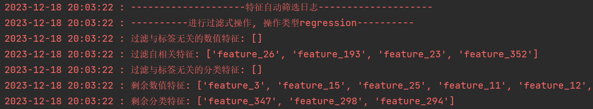  
```python
def filtering(self, df:pd.DataFrame, 
              feature_num:list, feature_clf:list, label_name:str):
    """
    以指标过滤式进行特征筛选
    :param df:数据集
    :param feature_num:数值特征列
    :param feature_clf:分类特征列
    :param label_name:标签列名
    :return:过滤后的数据集，数值特征列，分类特征列
    """
```
3. 嵌套式筛选。调用实例.nesting(**params)方法，入参与过滤式的形式相似，包括数据集dataframe，特征列名list(包含数值特征或分类特征)，以及标签列名str，返回对应重要性排名在top_N的特征列list。  
控制台打印日志展示如下。
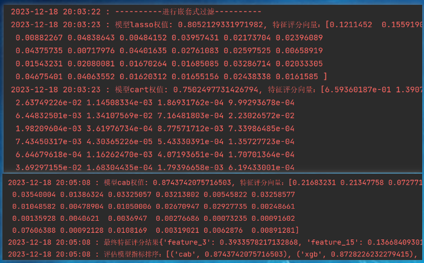  
    
4. 包裹式筛选。调用实例.wrapping(**params)方法，入参与嵌套式相同，包括数据集dataframe，特征列名list(包含数值特征或分类特征)，
以及标签列名str，同时指定评价基模型base_model，默认为cart树模型，以及要寻找的最大特征组数量group_n，默认为-1，对应为输入列名的数量，即不做限制。  
算法依次从一个特征数量开始，逐步加入新特征，每次找到能使评分模型最优的特征加入特征池。最后返回在给定特征数量group_n之内，使得评分基模型效果最好的特征组列名list。  
控制台输出日志如下。
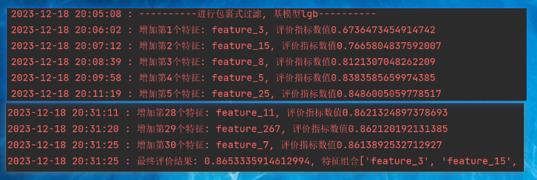  

## 三.附录：主要代码介绍
### 3.1过滤式评估指标
&emsp;&emsp;过滤式计算指标包括两类，第一类为皮尔森相关系数，用于度量数值变量与数值标签（回归问题）、数值变量之间的相关性，**算法保留与数值标签相关性大于阈值的特征，过滤特征间相关性大于阈值的特征，保留其中与标签最相关的特征**；
第二类为卡方检验p值或互信息数值，见`_indpendent_test()`方法，用于度量分类标签（分类问题）与分类特征、数值特征的分布独立性，或用于度量数值标签（回归问题）与分类特征的分布独立性。**需要注意的是，在调用该方法时，需要对数值数据进行离散化分箱，保证结果的准确性**。
```python
def _indpendent_test(self, dist_feature, dist_target: pd.Series,
                     box_trans=False, method='ch2'):
    """
    变量独立性检验：卡方检验、互信息计算数值、KL散度
    使用于一组变量为类别变量
    :param dist_feature: 特征数组
    :param dist_target: 标签数组
    :param box_trans: 是否对特征数组进行分箱，用于数值特征离散化
    :param method: 选择独立性检验方法
    :return:
    """
    boxes = 20
    if box_trans:  # 特征离散化
        dist_feature = pd.qcut(dist_feature, q=boxes,
                               duplicates='drop', labels=False)  # 自适应最小unique
    if self.fit_type == 'regression':  # 标签离散化
        dist_target = pd.qcut(dist_target, q=boxes,
                              duplicates='drop', labels=False)
    # 转换为二维矩阵
    dist_feature = np.asarray(dist_feature).reshape(-1, 1)
    dist_target = np.asarray(dist_target).reshape(-1, 1)
    if method == 'ch2':
        # _, p = chi2(dist_feature, dist_target)
        p = chi2(dist_feature, dist_target)[1][0]  # p<0.05 拒绝原假设 变量不独立
        if p <= self.p_val:
            return p, False
        return p, True
    else:
        # 互信息值
        if box_trans:
            mi = mutual_info_regression(dist_feature, dist_target)[0]  # 越趋近0越独立
        else:
            mi = mutual_info_classif(dist_feature, dist_target)[0]
        if mi >= 0.2:
            return mi, False
        return mi, True
```

### 3.2嵌套式评分模型与参数空间
&emsp;&emsp;算法通过`_set_models()`内置了多种常见的评分基模型，包括cart Tree、xgboost、lightGBM、catboost，回归问题增加lasso回归，分类问题增加带l1正则化的logistic回归。
同时，基于评分基模型，通过`_set_params()`设置了对应模型的超参空间，使用者可以依据实际需求重写这两个方法。
```python
def _set_models(self):
    """
    初始化模型
    :return:分类问题与回归问题的模型字典
    """
    reg_keys = ['lasso', 'cart', 'xgb', 'lgb', 'cab']
    clf_keys = ['logit'] + reg_keys[1:]
    lasso = Lasso
    logit = LogisticRegression
    cart_reg = DecisionTreeRegressor
    cart_clf = DecisionTreeClassifier
    xgb_clf = XGBClassifier
    xgb_reg = XGBRegressor
    lgb_reg = LGBMRegressor
    lgb_clf = LGBMClassifier
    cab_reg = CatBoostRegressor
    cab_clf = CatBoostClassifier

    reg_model = dict(zip(reg_keys,
                         [lasso, cart_reg, xgb_reg, lgb_reg, cab_reg]))
    clf_model = dict(zip(clf_keys,
                         [logit, cart_clf, xgb_clf, lgb_clf, cab_clf]))
    if self.fit_type == 'regression':
        self.search_models = reg_model
    elif self.fit_type == 'classification':
        self.search_models = clf_model
    else:
        raise ValueError(f'错误的值{self.fit_type}, fit_type取值为regression或classification')

def _set_params(self):
    """
    初始化各个模型超参空间字典
    """
    random_seed = 2023  # TODO设置随机种子
    cart_params = {'max_depth': [x for x in range(2, 15, 2)]}
    xgb_params = {'max_depth': [x for x in range(2, 11, 2)],
                  'n_estimators': [25, 50, 75, 100],
                  'learning_rate': [5e-1, 1e-1, 5e-2],
                  'seed': [random_seed],
                  'importance_type': ['gain']}
    lgb_params = {'objective': ['regression'],
                  'max_depth': [x for x in range(2, 11, 2)],
                  'n_estimators': [30, 60, 100],
                  'learning_rate': [5e-1, 1e-1, 5e-2],
                  'random_state': [random_seed],
                  'verbosity': [-1],  # 隐藏警告信息
                  'importance_type': ['gain']}
    cab_params = {'max_depth': [x for x in range(2, 11, 2)],
                  'iterations': [25, 50, 75, 100],
                  'learning_rate': [5e-1, 1e-1, 5e-2],
                  'random_state': [random_seed],
                  'verbose': [False]}
    lasso_params = {'alpha': list([0.1 * x for x in range(1, 101, 5)])}
    logit_params = {'penalty': ['l1'],
                    'solver': ['saga'],
                    'C': list([0.1 * x for x in range(1, 101, 5)])}
    self.search_params = {'lasso': lasso_params,
                          'logit': logit_params,
                          'cart': cart_params,
                          'xgb': xgb_params,
                          'lgb': lgb_params,
                          'cab': cab_params
                          }
```

### 3.3超参搜索器
&emsp;&emsp;超参搜索器主要用于搜索评分基模型最或较优超参组合，算法内置了三种算子：网格搜索、随机搜索、贝叶斯搜索。三者各有优劣。  
&emsp;&emsp;网格搜索暴力遍历参数组合，牺牲效率换取最好的效果；随机搜索根据一定的随机性，随机抽取参数组合，迭代至最大的次数，效率最快但效果可能是最差的；贝叶斯搜索主要基于已有的参数组合效果，以一定的条件分布抽取新的参数组合，兼顾效率与效果。
算法通过`_set_seacher()`进行设置，默认使用网格搜索。
```python
def _set_seacher(self, model, param_dist: dict, scoring_fun, cv=None):
    """
    自定义超参寻优方法
    :param model: 模型
    :param param_dist: 参数空间
    :param scoring_fun: 评价函数， str or function
    :param cv: k折，int or 自定义划分方法
    :return:
    """
    if cv is None:
        cv = 4
    if self.parms_search == 'grid':
        searcher = GridSearchCV(model,
                                param_grid=param_dist,
                                cv=cv,
                                scoring=scoring_fun)
    elif self.parms_search == 'random':
        searcher = RandomizedSearchCV(model,
                                      param_dist,
                                      cv=cv,
                                      scoring=scoring_fun,
                                      n_iter=50, random_state=42)
    else:
        searcher = BayesSearchCV(estimator=model,
                                 search_spaces=param_dist, n_jobs=-1, cv=cv,
                                 scoring=scoring_fun)
    return searcher
```

### 3.4内置评价指标
&emsp;&emsp;算法分别内置了回归和分类问题的模型效果评估指标，主要用于交叉验证和重要性权值计算。  
&emsp;&emsp;`_set_metrics()`方法用于初始化评分指标字典，`_metric_fun()`方法用于根据参数`self.fit_type、self.fit_metric`调用评分字典，输出评分数值。  
&emsp;&emsp;**需要注意的是，当fit_metric为None时，回归问题默认评价指标为r2，分类问题为accuracy**。
```python
def _set_metrics(self):
    # 定义评估指标字典
    reg = {'r2': metrics.r2_score,
           'mape': metrics.mean_absolute_percentage_error,
           'mse': metrics.mean_squared_error}
    clf = {'auc': metrics.accuracy_score,
           'recall': metrics.recall_score,
           'precision': metrics.precision_score,
           'rec_pre': self.metric_rec_pre,
           'f1': metrics.f1_score,
           'roc_auc': metrics.roc_auc_score}
    self.search_metrics = {'regression': reg, 'classification': clf}

def _metric_fun(self, y_true, y_pred):
    """
    进行指标评价
    :param y_pred:
    :param y_true:
    :return:
    """
    self._set_metrics()
    if self.fit_type == 'regression':
        if self.fit_metric is None:
            self.fit_metric = 'r2'  # 回归问题默认评价指标为r2
    else:
        if self.fit_metric is None:
            self.fit_metric = 'auc'  # 分类问题默认是准确率
    val = self.search_metrics[self.fit_type][self.fit_metric](y_true, y_pred)
    return val
```

----

# 算法2：AutoModel自动化建模算法介绍
## 一.介绍
&emsp;&emsp;该自动建模算法适用于结构化数据的监督学习场景，对给定的特征组，快速训练多个不同的基模型，并基于基模型的结果，自动寻找最优的集成路径，实现快进行模型选型、集成方法选择，提高建模效率。  
该算法主要包括三个模块：
1. 基模型超参搜索与训练  
2. 基模型结果最优集成路径搜索  
3. 最后模型的预测，保存预加载预训练模型

## 二.使用方式
###2.1 数据准备
&emsp;&emsp;在运行算法前，需要对原始数据完成数据清洗、数据转换、特征工程、特征过滤，得到最终的关键特征组。  
&emsp;&emsp;与AutoFeature相同，目前算法能够处理回归问题以及二分类问题的自动建模，暂不支持对多分类问题的自动化处理。以下展示*sample.csv*数据集里的基本数据情况。
    **数据展示：特征列，标签列，数据类型
###2.2 运行内置方法
1. 实例化。根据问题指定必要的参数，必须要指定的是*fit_type*参数，若是回归问题则传入*regression*，分类问题则传入*classification*。
其余参数含义参考注释，默认值可以满足大多数使用场景。根据*sample.csv*数据可以进行该实例化：  
`automodel = AutoModel(fit_type='classification', fit_metric='rec_pre')`  
表示场景为分类问题，评价指标选择racall与precision的复合指标
```python
    def __init__(self, fit_type='regression', fit_metric=None, k_cv=4, metric_filter=0.8,
                 params_searcher='grid', log_path='auto_model.log'):
        super(AutoModel, self).__init__()
        self.fit_type = fit_type                # 问题是回归还是分类问题
        self.fit_metric = fit_metric            # 模型多折验证评价指标
        self.k_cv = k_cv                        # 进行几折交叉验证
        self.metric_filter = metric_filter      # 过滤评价指标低于该值的基模型
        self.params_searcher = params_searcher  # 超参搜索器 grid or random or bayes
        self.stack_model = {}
        if self.fit_type not in ['regression', 'classification']:
            raise ValueError(f'错误的值{self.fit_type}, fit_type取值为regression或classification')
        if self.params_searcher not in ['grid', 'random', 'bayes']:
            raise ValueError(f"错误的值{self.params_searcher}, params_searcher取值为['grid', 'random', 'bayes']")
        # 日志模块
        self.log = Logger(path=log_path)
        self.log('--' * 10 + f'自动化建模日志 建模类型{self.fit_type}' + '--' * 10)
```

2. 模型训练与集成。调用实例automodel.best_fit(**params)方法即可。
入参为数据集dataframe，特征列名list，以及标签列名str。模型超参寻优、训练评价指标等相关信息将保存在log_path中，运行过程控制台打印日志展示如下。
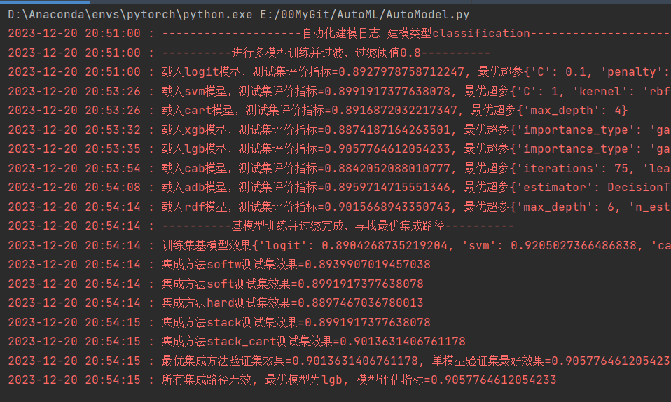  
```python
def best_fit(self, df: pd.DataFrame, feture_ls: list, label_name: str, models=None):
    """
    训练基模型，并寻找最优集成路径
    :param df: 数据集
    :param feture_ls: 使用的特征列名 
    :param label_name: 标签名称
    :param models: 制定的基模型，默认None，采用所有预设基模型
    :return: 最优模型
    """
```

3. 结果预测。调用实例automodel.predict(**params)方法。
输入参数为特征数据，可以是dataframe格式或者是np.array格式，将返回模型的最终预测结果，若存在最优集成路径，则返回多个模型的最优集成结果。
```python
 def predict(self, X_feature: pd.DataFrame or np.array):
        """
        结果预测
        :param X_feature:特征数据 
        :return: 
        """
```

4. 模型保存与加载。运行`automodel.save_model(file_path)`保存训练好的最优模型，并通过`load_model(file_path)`进行模型加载。
path默认为None，将保存至或加载来自`./auto_model`的模型文件。包括最优模型，或最优集成路径的基模型、相关权重、新的集成模型等。
```python
# 保存
automodel.save_model(path=None)
# 载入预测
automodel.load_model(path=None)
yp = automodel.predict(df[feature])
```

## 三.附录：模型集成方法说明
### 3.1 voting
&emsp;&emsp;算法内置基模型包含了单个基础模型以及boost、bagging相关的集成学习模型，对于这些模型的结果，设计了软硬投票的方式进行集成。  
&emsp;&emsp;软投票主要根据基模型在测试集上的评价指标进行平方归一化作为权值，或设置权值全为1，对基模型的结果进行加权，适用于回归与分类问题。硬投票主要针对分类问题，
按照少数服从多数原则取基模型结果中出现最多的标签最为最终预测结果。
```python
def _voting(self, mat_rslt: np.array, soft=True, weight=None):
    """
    适用分类的概率结果或回归的数值结果加权
    """
    if soft:
        if weight is None:
            result = np.mean(mat_rslt, axis=1)
        else:
            if isinstance(weight, dict):
                w = np.array(list(weight.values()))
            else:
                w = weight
            w = w * w
            w = w / sum(w)  # 归一化
            result = np.sum(mat_rslt * w, axis=1)
        if self.fit_type == 'classification':
            # 0-1分割概率阈值0.5
            result[np.where(result < 0.5)] = 0
            result[np.where(result >= 0.5)] = 1
    else:
        # 硬投票适用于分类问题
        thre = np.floor(mat_rslt.shape[1] / 2)
        result = np.sum(mat_rslt, axis=1) - thre
        result[np.where(result <= 0)] = 0
        result[np.where(result > 0)] = 1
    return result
```

### 3.2 stacking
&emsp;&emsp;stacking的集成方式需要以基模型的预测结果作为特征重新训练新的分类或回归模型，为了降低过拟合风险，
算法预设了结构尽简单的模型，如回归采用lasso或浅层cart树(<=3层)，分类采用logit或浅层cart树。
```python
def _stacking(self, mat_train: np.array, y_train, mat_test: np.array, base_mode=None):
    """
    satacking基模型不能太复杂
    回归选择cart lasso
    分类选择logist cart
    """
    if base_mode is None:
        if self.fit_type == 'regression':
            base_mode = 'lasso'
        else:
            base_mode = 'logit'
    self._set_models()
    self._set_params()
    if base_mode == 'cart':
        # 树模型要求要简单
        self.search_params[base_mode] = {'max_depth': [1, 2, 3]}
    score_fun = metrics.make_scorer(self._metric_fun)  # make_score封装
    model = self.search_models[base_mode]
    # 寻找最优参数
    seacher = self._set_seacher(model(), self.search_params[base_mode],
                                scoring_fun=score_fun,
                                cv=self._k_split(mat_train, y_train))
    seacher.fit(mat_train, y_train)
    if base_mode == 'cart':
        self.stack_model['stack_cart'] = seacher  # 用于预测阶段
    else:
        self.stack_model['stack'] = seacher
    return seacher.predict(mat_test)
```

### 3.3 集成路径选择
&emsp;&emsp;对于集成路径的选择，主要在验证集上筛选效果最好集成方法和最好的基模型，若`最好集成方法评价指标 > 最好基模型评价指标`则得到有效的集成方法，与基模型一起作为最优模型总成，否则最优模型为效果最好的基模型。
```python
def best_ensemble(self, mat_train: np.array or dict, mat_test: np.array or dict):
    """
    进行最优最优集成选型
    """
    self.log(f'训练集基模型效果{self.train_matric}')
    self._set_ensemble_method()
    if isinstance(mat_train, dict):
        mat_train = np.array(list(mat_train.values())).T  # shape = (n_samples, n_models)
        mat_test = np.array(list(mat_test.values())).T
    ensemble_metric = {}
    for k, ensemble in self.ensembler[self.fit_type].items():
        if k not in ['stack', 'stack_cart']:
            m = self._metric_fun(self.y_test, ensemble(mat_test))
        else:
            m = self._metric_fun(self.y_test, ensemble(mat_train, self.y_train, mat_test))
        ensemble_metric[k] = m
        self.log(f'集成方法{k}测试集效果={m}')
    # 对比训练集筛选最好的集成方法
    k_e, m_test_e = max(ensemble_metric.items(), key=lambda x: x[1])
    # k_train, m_train = max(self.train_matric.items(), key=lambda x: x[1])
    k_test, m_test = max(self.test_matric.items(), key=lambda x: x[1])
    # 更新集成函数字典
    for sk in ['stack', 'stack_cart']:
        self.ensembler[self.fit_type][sk] = partial(self._model_pred,
                                                    model=self.stack_model[sk])
    self.log(f'最优集成方法验证集效果={m_test_e}, 单模型验证集最好效果={m_test}')
    if m_test_e > m_test:
        # 集成路径有效
        self.log(f'集成路径{k_e}最优, 验证集评估指标={m_test_e}')
        return 1, k_e, self.ensembler[self.fit_type][k_e]
    else:
        self.log(f'所有集成路径无效, 最优模型为{k_test}, 模型评估指标={m_test}')
        return 0, k_test, partial(self._model_pred, model=self.models_fit[k_test])
```
---

# 开发3：Autoplot绘图类介绍
## 一.介绍
&emsp;&emsp;该项目适用于特征探索阶段进行可视化分析，针对业务场景寻找一些know how，以进行下一步特征工程。  
&emsp;&emsp;可视化分析常用绘图命令繁琐，特别是当存在多种应用场景时，代码迁繁琐，为此项目主要开发多个场景的快速会图命令:
1. 数值变量分析：单个数值变量分布、数值变量在分类变量或时序下的分布、数值变量与数值变量的联合分布关系
2. 分类变量分析：单个分类变量分布统计，两个分类变量交叉分布统计
3. 其他：单个分类变量对多个数值变量的影响  
**以上为目前的使用场景，后续出现新的场景将持续补充**  
**使用方法和demo可以参考文件`auto_plot示范.ipynb`**
## 二.使用方法
###2.1 实例化AutoPlot
&emsp;&emsp;实例化只需要指定图片存储路径save_path，按照指定的格式进行定义即可，其他预设的参数一般不需要修改，可以参照__init__方法进行调整
```python
### 实例化绘图类
save_path = r'./{}_{}.{}' # {}固定图片保存格式
autoPlot = AutoPlot(save_path=save_path)
```
###2.2 初始化画布
&emsp;&emsp;本方案绝大部分绘图方法调用的基本流程都是初始化画布和子图，调用autoPlot绘图方法，在方法中传入子图和其他参数即可。
初始化画布一般使用`plt.subplots(**parms)`进行定义。
```python
import matplotlib.pyplot as plt
fig, axe = plt.subplots(1,3, figsize=(20,7))
plt.subplots_adjust(wspace=0.3) # 按需调整子图样式
```
###2.3 调用相关方法
&emsp;&emsp;autoPlot的绘图方法调用风格一致，以下以单个数值变量在分类变量下的分布进行示范。  
1.首先确定特征-标签数据集，必须是dataframe格式（df）  
2.确定需要分析的数值变量列名num_name，分类变量列名cat_name  
3.确定想要可视化的形式：kde or box or violin  
一般autoPlot方法调用的传参形式为`autoPlot.func(df, num_name, cat_name, axe_type=建立的子图, **parms)`。
即只需要传入dataframe的一些信息，子图画布，及其他定制化参数即可。  
示例：绘制不同分布只需要将子图axe传入对应的画布类型：
```python
fig, axe = plt.subplots(1,3,figsize=(25,8))
autoPlot.num_seq_plot(df, num_name='price', seq_name='feature_294', ax_kde=axe[0])
autoPlot.num_seq_plot(df, num_name='price', seq_name='feature_294', ax_box=axe[1])
autoPlot.num_seq_plot(df, num_name='price', seq_name='feature_294', ax_vln=axe[2])
```
结果展示：
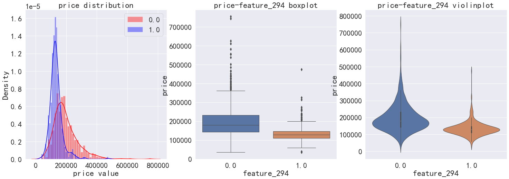
进一步查看数值变量在某个序列变量下的分布，同样只需要指定相关dataframe，列名和画布即可：
```python
# 序列变量下的分布 散点 or 折线，适用于时序可视化
fig, axe = plt.subplots(1,2,figsize=(20,8))
autoPlot.num_seq_plot(df, num_name='price', seq_name='feature_3', ax_line=axe[0]) # 折线
autoPlot.num_seq_plot(df, num_name='price', seq_name='feature_3', ax_sca=axe[1])  # 散点 
```
绘图结果展示：
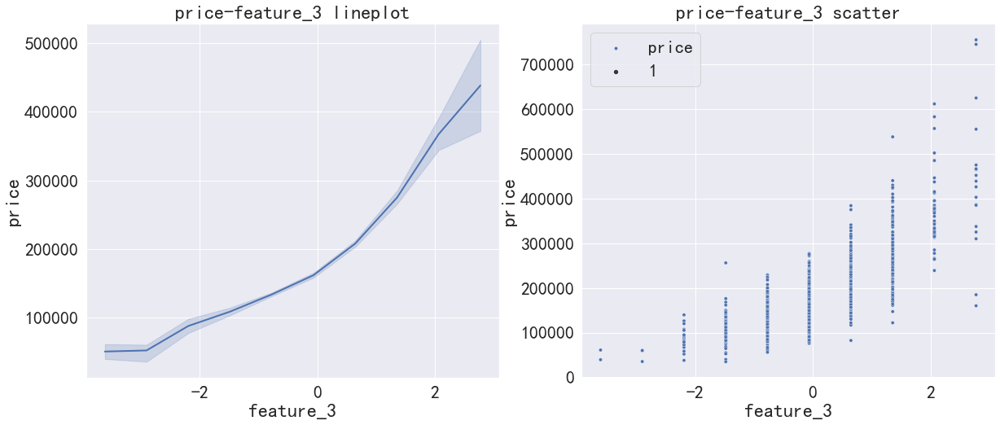

###三. 其他可视化场景展示
###3.1 单数值变量分布
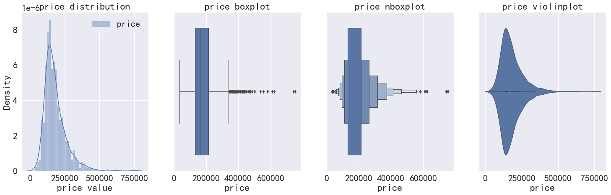

###3.2 多个数值变量分布关系
**相关性热力图**
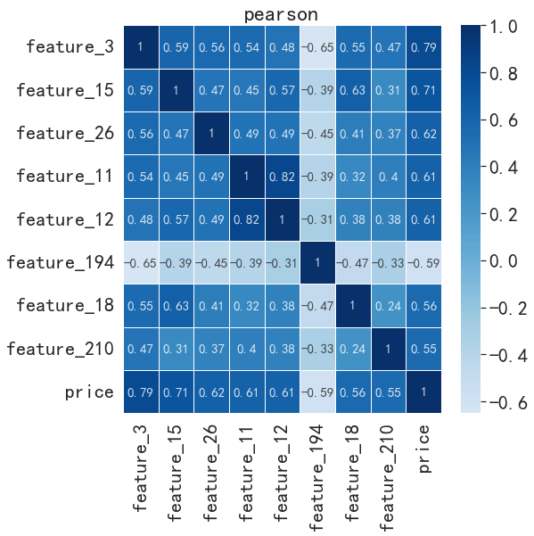

**pair plot配对分布图**
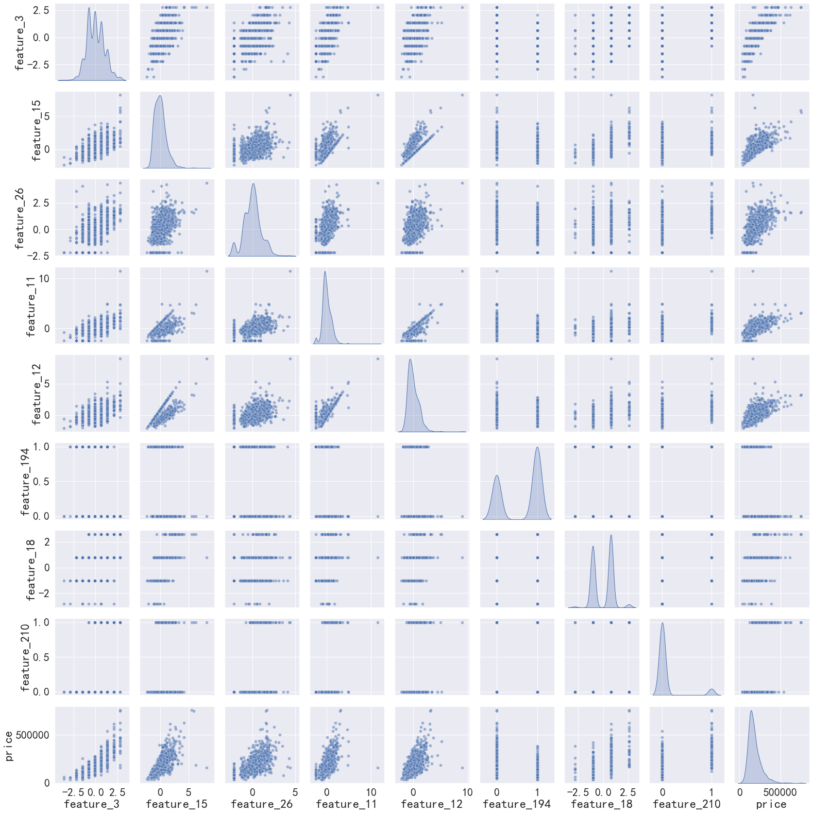

###3.3 两个数值变量2d分布密度
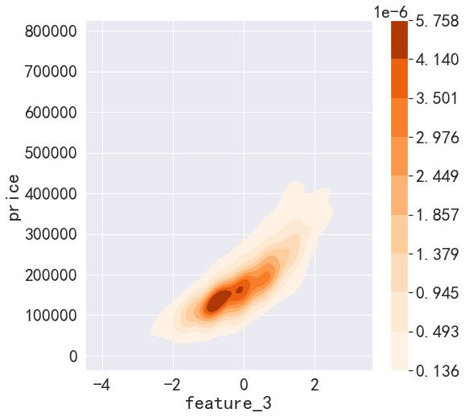

###3.4 两个数值变量qq图对比
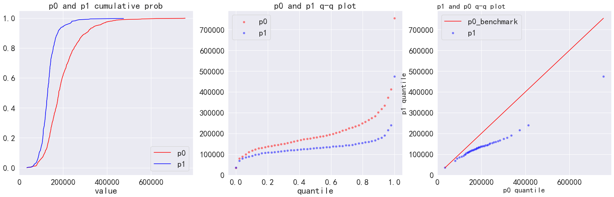

###3.5 单个分类变量分布统计
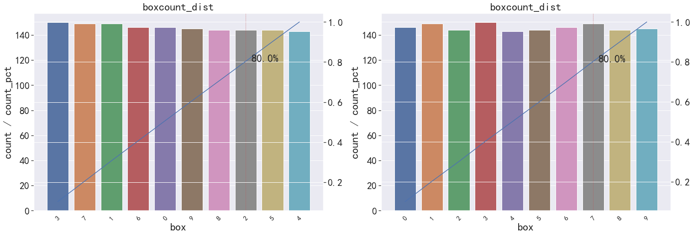

###3.6 两个个分类变量交叉分布统计
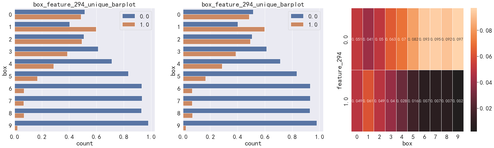

###3.7 一个分类变量对多个数值变量的区分（二分类场景）
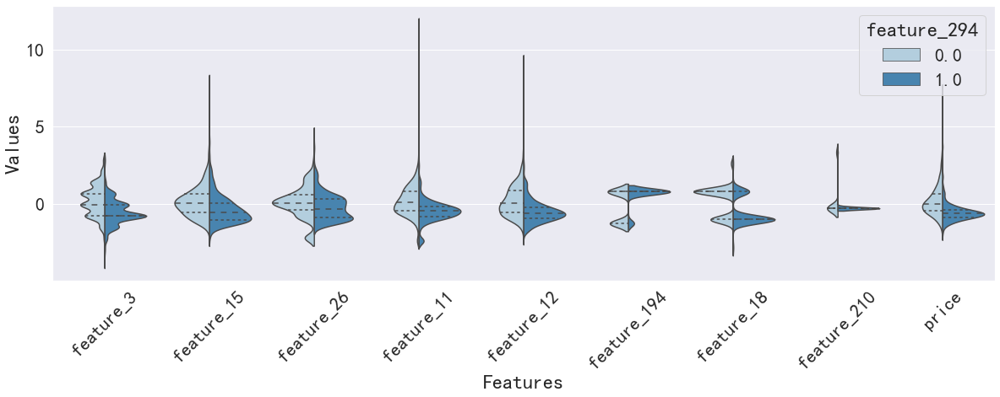